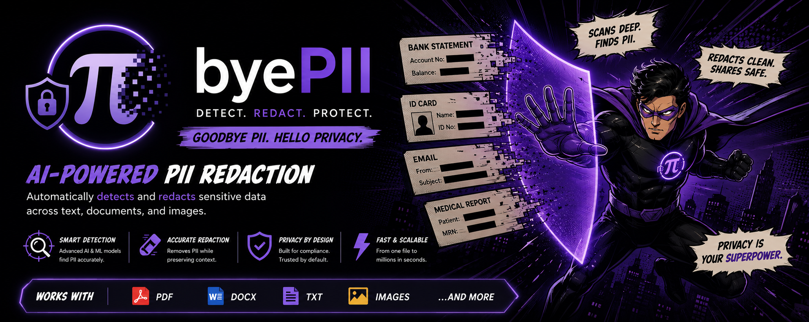
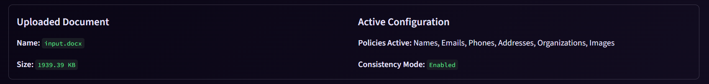
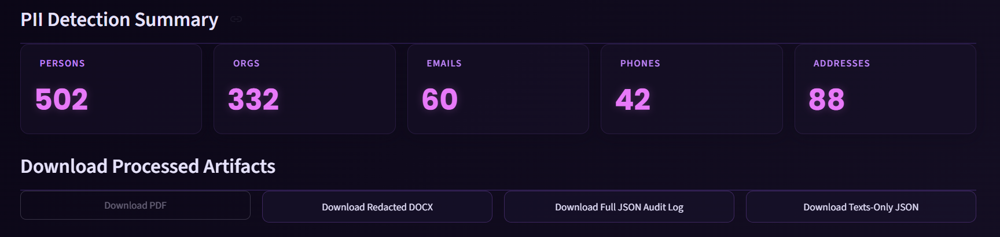

# byePII — Enterprise Document Anonymization Platform

### Live Demo

**https://byepii.streamlit.app**

> **⚠️ Currently unavailable.** The Streamlit Cloud deployment is failing due to dependency installation issues (100+ packages). Please clone the repository and run the application locally until the deployment is fixed.
<p align="center">
  
</p>

**byePII** is an AI-powered document anonymization platform that automatically detects and anonymizes Personally Identifiable Information (PII) from corporate, legal, and financial documents before they are shared publicly. Instead of simply hiding sensitive information, byePII intelligently replaces it with realistic synthetic data, preserving the document's readability, formatting, and overall structure.

---

# 1. Background

Organizations regularly publish documents such as Red Herring Prospectuses (RHPs), annual reports, agreements, and regulatory filings that often contain confidential personal or corporate information. Manually reviewing these documents is slow, error-prone, and difficult to scale.

byePII was built to automate this process by accurately identifying sensitive information and replacing it with realistic alternatives while ensuring the document remains natural to read.

### What byePII can anonymize

- **Full Names** *(Rashi Patil → John Doe)*
- **Email Addresses**
- **Phone Numbers**
- **Company Names**
- **Residential & Mailing Addresses**
- **PAN, Aadhaar, SSN and other Government IDs**
- **Credit Card Numbers**
- **Dates of Birth**
- **IP & MAC Addresses**
- **Corporate Identifiers** such as CIN, DIN, IFSC, SWIFT, UPI IDs
- **Corporate Logos & Identity Cards**

---

# 2. Why "byePII"?

The name is simple and intentional.

Instead of permanently blacking out sensitive information, **byePII** says *"goodbye"* to privacy risks by replacing confidential data with realistic synthetic alternatives. The result is a document that remains easy to read while protecting sensitive information.

---

# 3. Features

- **Dual Processing Pipeline** — Text analysis and visual document analysis run simultaneously for faster processing.
- **Consistent Entity Mapping** — The same person, company, or identifier is always replaced with the same synthetic value throughout the document.
- **Visual Redaction** — Detects and anonymizes corporate logos, PAN cards, Aadhaar cards, and similar visual elements using computer vision.
- **Audit Reports** — Generates downloadable JSON audit logs and detailed redaction summaries.
- **Document Structure Preservation** — Maintains formatting, spacing, and layout while performing replacements.

---

# 4. Output Previews




---

# 5. Getting Started

## Installation

Make sure you have **Python 3.10+** installed.

Create and activate a virtual environment:

```bash
python -m venv venv

# Windows (PowerShell)
.\venv\Scripts\Activate.ps1
```

Install the required dependencies:

```bash
pip install -r requirements.txt
```

---

## Run the Web Application

Launch the Streamlit dashboard:

```bash
streamlit run app.py
```

Upload a document, choose your anonymization settings, and download the redacted output directly from the browser.

---

## Run from the Command Line

For automated or headless workflows:

```bash
python run_cli.py --input input.docx
```

---

# 6. Documentation

Looking for a deeper technical explanation? The following documents cover the complete architecture and implementation details.

- **[System Architecture](system_architecture.md)** — Architecture diagrams, processing pipeline, component overview, and project structure.
- **[Input Fields & Parameter Analysis](input_fields.md)** — Analysis of supported sensitive entities, validation rules, and mapping strategy.
- **[Technology Stack Analysis](tech_stack.md)** — Explanation of the selected technologies and future improvements.
- **[System Limitations & Observations](limitations.md)** — Known limitations, edge cases, and future enhancement opportunities.


---

# 7. Future Roadmap

byePII is designed with scalability in mind. Some of the planned improvements include:

- **LLM-Assisted Verification** using Google Gemini to reduce false positives and improve entity recognition.
- **YOLO & LayoutLM Integration** for more robust detection of logos, identity cards, and complex document layouts.
- **Advanced OCR Pipeline** with EasyOCR for scanned and image-based PDFs.
- **Multilingual Support** for anonymizing documents across multiple languages.
- **Enterprise Deployment** with API support, role-based access control, and cloud-native infrastructure.

---

<div align="center">

### Made with ❤️ by **Akmal Hossain**

**23UEC116 • National Institute of Technology Agartala**

<br>

<a href="https://github.com/ak-2045">
  
</a>

<a href="https://www.linkedin.com/in/akmal-hossain-72a7b5277">
  
</a>

</div>
