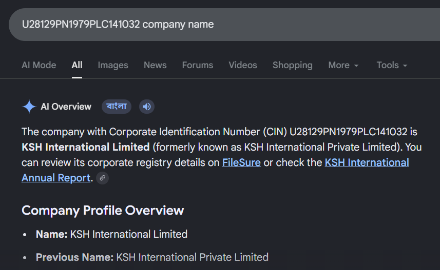
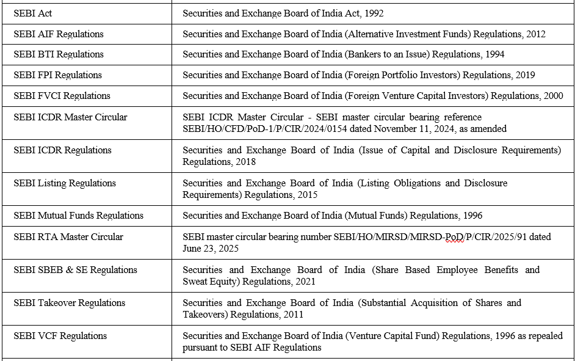
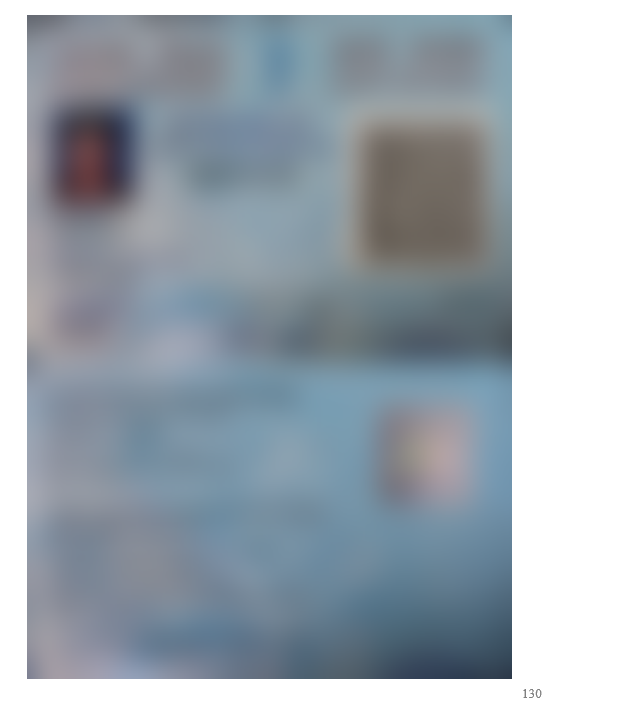
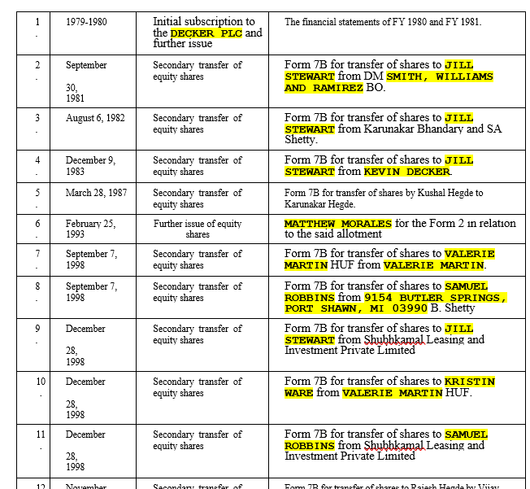
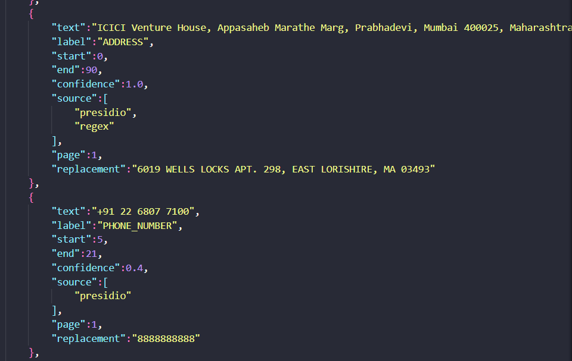

# Input Fields

This section explains how sensitive information was identified within the business documents, the reasoning behind the chosen redaction policies, and the overall performance of both the text and image anonymization pipelines.

---

# 1. Identifying Sensitive Fields

The first step was understanding what information could reveal an individual's or organization's identity. While the assignment specified a core set of Personally Identifiable Information (PII), real-world corporate documents contained several additional identifiers that also required protection.

## Assignment-Specified Fields

The following categories formed the minimum scope of detection:

- **Full Names** — including directors, promoters, shareholders, contact persons, and other individuals.
- **Email Addresses** — both official business emails and personal email accounts.
- **Phone Numbers** — mobile and landline numbers following common Indian numbering formats.
- **Company Names** — private companies, LLPs, partnerships, trusts, and HUFs.
- **Postal Addresses** — registered offices, branch offices, residential addresses, and mailing locations.
- **Government Identification Numbers** — SSNs (where applicable) and Indian equivalents such as Aadhaar and PAN.
- **Credit Card Numbers**
- **Dates of Birth**
- **IP and MAC Addresses**

## Additional Corporate Identifiers

During testing, it became clear that protecting only conventional PII was not enough. Several corporate identifiers could easily expose an organization's identity through publicly available databases, so they were added to the detection pipeline.

These included:

- **CIN (Corporate Identification Number)**
- **DIN (Director Identification Number)**
- **SEBI Registration Numbers**
- **IFSC Codes**
- **SWIFT Codes**
- **UPI IDs**



**Observation**

One interesting discovery was that identifiers such as **CIN** and **DIN** are almost like digital fingerprints for companies. Even if every company name is successfully removed, a quick lookup of these identifiers on the MCA portal can immediately reveal the original organization. In other words, leaving a single CIN behind is a bit like carefully hiding someone's face while forgetting to blur their name tag.

---

# 2. Policy-Based Redaction

Not every detected entity deserves to be redacted. In many cases, blindly masking everything that resembles an organization or location makes a document difficult to read without adding any meaningful privacy protection.

## Suppressing Public Regulatory Terms

Business reports frequently mention public institutions such as **SEBI**, **RBI**, or simply **India** within tables, headers, and legal disclosures.

Although these terms match organization or location detection rules, they are public references rather than sensitive information. Redacting them only damages document readability while providing no additional privacy benefit.

To avoid this, a blacklist-based suppression policy was introduced so that commonly occurring public entities are preserved during redaction.



This small rule dramatically improved the visual quality of the final documents by preventing unnecessary black boxes from appearing throughout tables and footers.

---

## Visual Redaction of Identity Cards

Besides text, the system also examined embedded images for identity documents.

The image pipeline produced mixed results:

- **PAN Card** — Successfully detected and blurred using OpenCV template matching.
- **Aadhaar Card** — Detection failed in several test cases.



### Why Aadhaar Detection Was Less Reliable

The failure was less about the Aadhaar card itself and more about the limitations of traditional template matching.

The primary reasons were:

1. **Scale Variation**

   The Aadhaar image inside the document was resized beyond the predefined search range, causing the reference template and document image to no longer align correctly.

2. **Visual Differences**

   Template matching performs best when two images look almost identical. Small differences in colour, compression artifacts, lighting, or background textures significantly reduced the similarity score.

3. **Rotation and Skew**

   Even a slight rotation introduced during scanning prevented the axis-aligned template matcher from recognising the card with sufficient confidence.

These observations highlight an important limitation of classical computer vision methods—they are fast, but they are not particularly forgiving when images refuse to stay perfectly behaved.

---

# 3. Redaction Results & Mapping Consistency

Despite the edge cases, the text anonymization pipeline consistently detected and replaced sensitive information across the tested documents.

Every detected entity was substituted with a synthetic replacement generated through Faker while maintaining a persistent mapping throughout the document. This ensured that repeated occurrences of the same person, company, or identifier were always replaced with the same anonymized value, preserving document consistency.





### Additional Improvements

- **Consistent Replacement Mapping** ensured identical entities were anonymized uniformly across every page.
- **Enhanced Visual Formatting** displayed replacements using bold, uppercase text, making redacted regions immediately distinguishable during verification.
- **Audit Logging** recorded every replacement, allowing the anonymization process to remain transparent and traceable.

Had a **policy.json** in mind -
```json
{
  "must_redact": {
    "person": [
      "full_name",
      "initials",
      "father_name",
      "mother_name",
      "spouse_name",
      "guardian_name",
      "signature",
      "photograph",
      "date_of_birth"
    ],
    "contact": [
      "email_address",
      "phone_number",
      "mobile_number",
      "fax_number",
      "website_url",
      "domain_name"
    ],
    "address": [
      "residential_address",
      "mailing_address",
      "registered_office_address",
      "corporate_office_address",
      "branch_address",
      "factory_address",
      "postal_address",
      "pin_code_when_part_of_address"
    ],
    "organization": [
      "company_name",
      "subsidiary_name",
      "client_name",
      "vendor_name",
      "merchant_banker",
      "registrar",
      "auditor",
      "law_firm",
      "consultant_name",
      "contact_person",
      "director_name",
      "promoter_name",
      "shareholder_name",
      "huf_name",
      "trust_name",
      "partnership_name"
    ],
    "government_identifiers": [
      "pan_number",
      "aadhaar_number",
      "passport_number",
      "driving_license_number",
      "voter_id",
      "din",
      "cin",
      "gstin",
      "llpin",
      "iec",
      "lei",
      "sebi_registration_number",
      "rbi_registration_number",
      "firm_registration_number",
      "peer_review_number"
    ],
    "financial": [
      "bank_account_number",
      "ifsc_code",
      "swift_code",
      "upi_id",
      "credit_card_number",
      "debit_card_number"
    ],
    "technical": [
      "ip_address",
      "mac_address",
      "qr_code",
      "barcode"
    ],
    "branding": [
      "company_logo",
      "organization_logo",
      "seal",
      "stamp"
    ]
  },
  "conditional_redact": {
    "table_entries": [
      "person_name",
      "company_name",
      "shareholder_name",
      "director_name",
      "transfer_recipient",
      "transferor_name",
      "contact_person"
    ],
    "dates": [
      "date_of_birth"
    ],
    "identifiers": [
      "unique_reference_number",
      "application_number",
      "certificate_number"
    ]
  },
  "do_not_redact": [
    "share_price",
    "issue_size",
    "offer_size",
    "number_of_equity_shares",
    "face_value",
    "financial_statements",
    "profit",
    "loss",
    "ebitda",
    "revenue",
    "capital_structure",
    "shareholding_percentages",
    "offer_structure",
    "regulatory_text",
    "sebi",
    "nse",
    "bse",
    "companies_act",
    "icdr_regulations",
    "page_numbers",
    "table_headers",
    "section_titles",
    "dates_of_board_meetings",
    "historical_corporate_events",
    "currency_values",
    "amounts",
    "percentages"
  ],
  "entity_mapping": {
    "PERSON": "full_name",
    "PERSON_NAME": "full_name",
    "COMPANY": "company_name",
    "ORGANIZATION": "company_name",
    "ORG": "company_name",
    "DIRECTOR": "director_name",
    "PROMOTER": "promoter_name",
    "SHAREHOLDER": "shareholder_name",
    "CONTACT_PERSON": "contact_person",
    "REGISTRAR": "registrar",
    "MERCHANT_BANKER": "merchant_banker",
    "AUDITOR": "auditor",
    "LAW_FIRM": "law_firm",
    "CONSULTANT": "consultant_name",
    "EMAIL": "email_address",
    "EMAIL_ADDRESS": "email_address",
    "PHONE": "phone_number",
    "PHONE_NUMBER": "phone_number",
    "MOBILE_NUMBER": "mobile_number",
    "ADDRESS": "residential_address",
    "LOCATION": "residential_address",
    "GPE": "residential_address",
    "PAN": "pan_number",
    "AADHAAR": "aadhaar_number",
    "PASSPORT": "passport_number",
    "GSTIN": "gstin",
    "CIN": "cin",
    "DIN": "din",
    "IEC": "iec",
    "LEI": "lei",
    "IFSC": "ifsc_code",
    "SWIFT": "swift_code",
    "UPI": "upi_id",
    "URL": "website_url",
    "DOMAIN": "domain_name",
    "IP_ADDRESS": "ip_address",
    "MAC_ADDRESS": "mac_address",
    "CREDIT_CARD": "credit_card_number",
    "DEBIT_CARD": "debit_card_number",
    "QR_CODE": "qr_code",
    "BARCODE": "barcode",
    "SIGNATURE": "signature",
    "FACE": "photograph",
    "LOGO": "company_logo",
    "STAMP": "stamp",
    "SEAL": "seal"
  }
}
```
---

# 4. Future Improvements

While the current pipeline performs well on structured business documents, combining rule-based detection with a Large Language Model could substantially improve accuracy.

A secondary verification layer using models such as **Gemini** could:

- Validate uncertain detections.
- Reduce false positives.
- Detect contextual privacy leaks that traditional pattern matching may overlook.
- Better understand complex tables, forms, and semi-structured layouts.

Rather than replacing the existing system, an AI verification stage would serve as an intelligent second reviewer—much like having another pair of eyes check your work before submission. In privacy-sensitive applications, that extra layer of scrutiny can make a meaningful difference.

