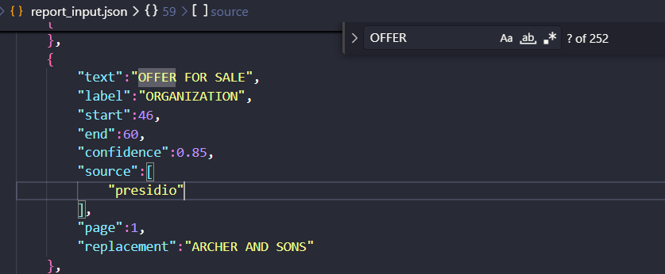
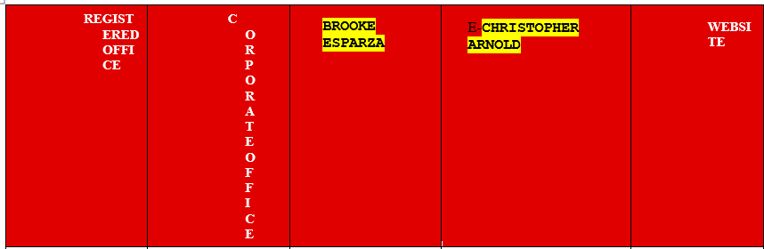
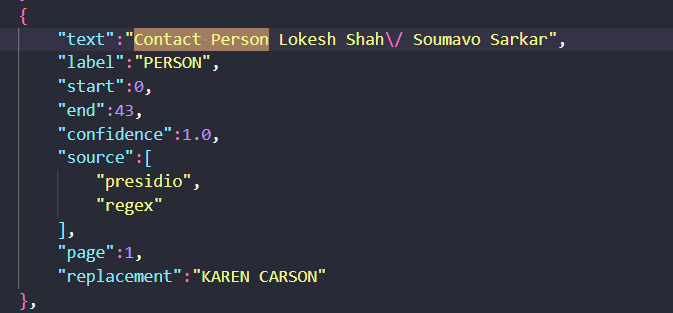
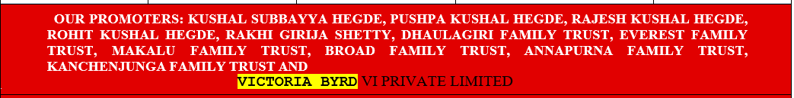
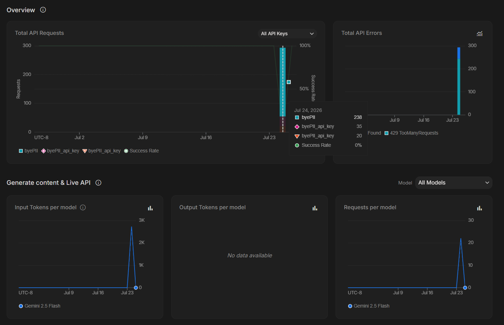
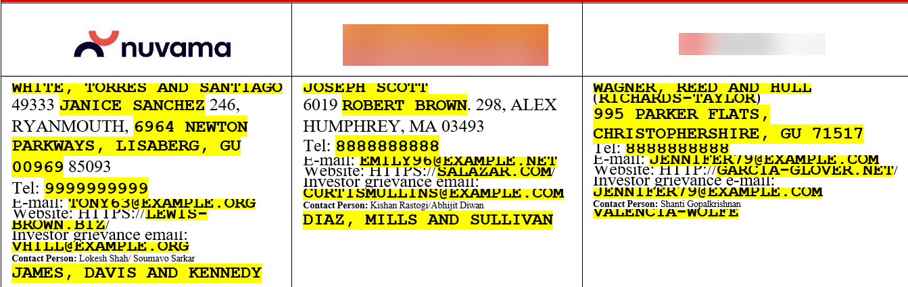
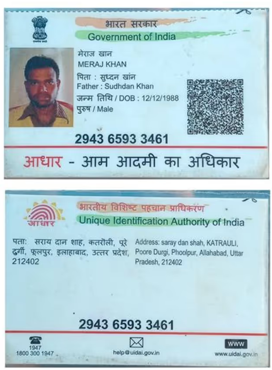

# Limitations and Observations

This document summarizes the key limitations and observations I encountered while developing and testing **byePII**. Rather than hiding these challenges, I documented them to better understand the system's current boundaries and identify opportunities for future improvements.

---

# 1. Natural Language Processing and Text Redaction Limitations

Although the text redaction pipeline performs well in most scenarios, several edge cases emerged during testing. These observations helped me understand where rule-based detection and traditional NLP models struggle when working with real-world business documents.

## A. False Positives in Entity Classification

Despite implementing whitelist filters and custom validation rules, Microsoft Presidio occasionally classified common words such as **"Offer"** or layout phrases like **"MAIL and TELEPHONE"** as `ORGANIZATION` entities.

This behavior occurred because these words appeared in uppercase or business-style formatting, causing the NLP model to interpret them as company names rather than ordinary document text.



Although additional filtering reduced many of these errors, the issue demonstrates that contextual understanding remains one of the biggest limitations of rule-based PII detection.

---

## B. Table Header Extraction Issues

Structured tables introduced another challenge during development.

I attempted to prevent unnecessary redactions by hardcoding common table headers and excluding them from the anonymization process. While this reduced false positives, inconsistencies in document layouts occasionally caused legitimate table headers to be detected as sensitive information.

As a result, some structured sections were partially redacted even though they contained no confidential data.



This highlights the difficulty of relying solely on text extraction when document structure varies significantly across different templates.

---

## C. Context-Aware Extraction Challenges

One particularly interesting observation involved names appearing beneath company logos.

The system successfully redacted headings such as **"Contact Person"**, but occasionally failed to redact the actual person's name displayed immediately below.



During debugging, I found that names following punctuation such as colons (`:`) disrupted the token alignment used by spaCy's Named Entity Recognition pipeline.

For example:

```text
Contact Person: John Doe
```

In several cases, the model detected the heading correctly but ignored the name itself.

To address this issue, I introduced custom regular expression overrides for common patterns. While this improved detection, the solution is still rule-based and would benefit from a more generalized contextual extraction approach.

---

## D. Table Layouts and Acronym Over-Redaction

Business documents frequently contain abbreviations, regulatory organizations, and geographic references that should remain unchanged.

During testing, entities such as:

- SEBI
- RBI
- India

were sometimes classified as organizations or locations and subsequently redacted.

Although these technically match certain entity categories, they are public references rather than personally identifiable information.

To prevent unnecessary masking, I introduced hardcoded exceptions that preserve commonly occurring regulatory bodies and public geographic terms.

This workaround solved many practical cases but also illustrates the limitations of relying purely on Named Entity Recognition without understanding document intent.

---

## E. Paragraph-Level Name Recognition

Another edge case appeared inside long paragraphs.

Names that were correctly identified when written independently occasionally escaped redaction when embedded within larger blocks of text.



This behavior suggests that contextual complexity can influence entity confidence scores, causing otherwise valid names to be ignored.

A stronger contextual language model or an additional verification stage could improve detection in these situations.

---

## F. Dataset Size and GenAI API Constraints

To further validate the detected entities, I exported every extracted text segment into [`outputs/texts_report_input.json`](outputs/texts_report_input.json)

The resulting dataset contained approximately **11,000 individual text entries**, producing thousands of potential entity verification requests.



While my original plan was to verify these detections using a Large Language Model, the free Gemini API tier quickly reached its request limits after processing roughly 2,700 requests.

Because of this limitation, I relied primarily on local NLP libraries, regular expressions, whitelist rules, and heuristic validation instead of LLM-assisted verification.

Although this approach is computationally efficient, it sacrifices some contextual understanding that a modern language model could provide.

---

# 2. Image Processing and Computer Vision Limitations

The image anonymization pipeline performed well for known templates but also revealed several limitations that stem from the template-matching approach.

## A. Logo Detection and Template Matching

Using OpenCV's multi-scale template matching, I successfully detected and blurred several corporate logos, including:

- ICICI
- MUFG
- KHS

However, the pipeline consistently failed to detect the **Nuvama** logo.



The primary reason is that template matching relies heavily on visual similarity.

Even small differences in scale, orientation, resolution, cropping, or image quality can significantly reduce the similarity score, causing valid matches to be missed.

### Observation

This experience reinforced an important lesson.

Template matching works well for known images but does not generalize effectively.

A custom object detection model such as **YOLOv8** or **YOLOv9**, trained on a curated dataset using tools like **Label Studio**, would provide significantly better performance across different layouts and viewing angles.

---

## B. Identity Card Detection

The OpenCV similarity pipeline successfully identified and blurred PAN cards using the stored reference template.

However, it struggled to detect Aadhaar cards consistently.



Although both documents serve a similar purpose, their layouts, colors, and visual features differ enough that the existing similarity-based approach was unable to generalize effectively.

This limitation again highlights the trade-off between lightweight template matching and deep learning-based object detection.

---

## C. Local Hardware and Deployment Constraints

During development, I also explored integrating deep learning models such as YOLO into the project.

In practice, this proved difficult because of hardware limitations.

Even without deep learning models, the complete project environment occupies approximately **1.22 GB**.

Adding large computer vision models would significantly increase memory usage, startup time, and CPU requirements, making the application considerably slower on a standard laptop.

For a production deployment, moving computationally intensive tasks such as OCR and object detection to dedicated cloud services or containerized worker nodes would provide a much more scalable solution while keeping the frontend responsive.
